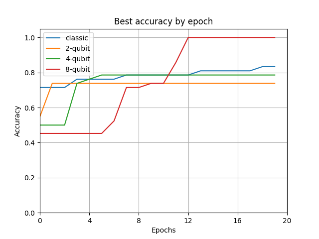
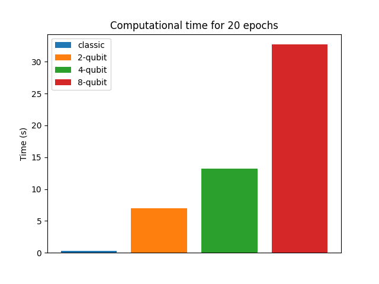

# Задача 3

Решение задачи было разделено на две части:

* получение векторных представлений (эмбеддингов) предложений;
* классификация полученных векторных представлений.

Создание эффективных эмбеддингов — сложная вычислительная задача, поэтому для нее использовался классический подход. Эмбеддинги были получены с помощью предобученной модели `RuBERT`: [ссылка](https://huggingface.co/DeepPavlov/rubert-base-cased-sentence).

Это реализовано в скрипте `pavlov_embed.py`, а результаты — эмбеддинти и таргеты — сохранены в файлы `data/X.pt` и `data/y.pt` соответственно.

Далее была построена классификационная модель

$$y = \sigma(f_3(\sigma_Q(f_2(\sigma_1(f_1(x)))))),$$

где $f_1, f_2, f_3$ — линейные полносвязные слои $\mathbb{R}^{768} \to \mathbb{R}^{128}$, $\mathbb{R}^{128} \to \mathbb{R}^8$ и $\mathbb{R}^8 \to \mathbb{R}$ соответственно; $\sigma_1$ и $\sigma$ — классические функции активации; $\sigma_Q$ — кватонвая функция активации.

В наших экспериментах $\sigma_1(x) = \mathrm{Id}(x)$ и $\sigma(x) = 1 / (1 + \exp(-x))$.

Квантовый слой $\sigma_Q(x)$ для четырех кубитов имеет вид
```
0: ─╭AngleEmbedding(M0)──RY(-0.15)─╭●───────╭X──RY(2.63)──╭●───────╭X──RY(0.87)─╭●───────╭X───RY(0.29)──╭●───────╭X─┤  <Z>
1: ─├AngleEmbedding(M0)──RY(-0.97)─╰X─╭●────│───RY(-1.03)─╰X─╭●────│───RY(2.29)─╰X─╭●────│────RY(0.90)──╰X─╭●────│──┤  <Z>
2: ─├AngleEmbedding(M0)──RY(0.15)─────╰X─╭●─│───RY(-0.78)────╰X─╭●─│───RY(1.62)────╰X─╭●─│────RY(-0.61)────╰X─╭●─│──┤  <Z>
3: ─╰AngleEmbedding(M0)──RY(-0.11)───────╰X─╰●──RY(0.42)────────╰X─╰●──RY(0.82)───────╰X─╰●───RY(-0.32)───────╰X─╰●─┤  <Z>
```

Он использует вентили $\mathit{CNOT}$ и $\mathit{RY}$ для запутывания электронов. В экспериментах используется восьмикубитная версия слоя с аналогичной структурой.

Обучающие данные были разбиты в отношении $4\colon 1$ на обучающую и валидационную выборку. В связи с большим количеством параметров модель склонна к переобучению, поэтому обучение велось на небольшом числе эпох (~20). Это позволило достичь наилучшего качества на валидационной выборке 100% на 13 эпохе обучения.

Работа алгоритма была проанализирована для числа кубитов $q \in \{2, 4, 8, 16\}$, а также с заменой квантового слоя на классическую функцию активации $\sigma_Q(x) = \mathrm{LeakyReLU}(x, 0.2)$.

Модели с квантовым слоем сильно подвержены переобучению: например, двухкубитная модель достигла лучшего качества на третьей эпохе и далее постепенно откатилась до качества ~50%. Аналогичные эффекты наблюдались для четырехкубитной и восьмикубитной моделей. Модель с шестнадцатью кубитами в целом не показала стремления к обучению, сохраняя на протяжении периода обучения валидационную точность 45%. Вероятно, это связанно с сильным зашумлением в квантовом слое активации.

В то же время классическая модель показала качество, сравнимое с четырехкубитной моделью. При этом, чтобы достигнуть точности 100%, классической модели потребовалось более 200 эпох обучения. Важным замечанием, конечно, будет то, что классическая модель расходует кратно меньше времени на обучение, однако данное сравнение не является корректным, поскольку квантовые вычисления совершаются на симуляторе.

На рисунках далее представлены зависимость лучшего валидационного качества от эпохи обучения и время обучения моделей на 20 эпох.


